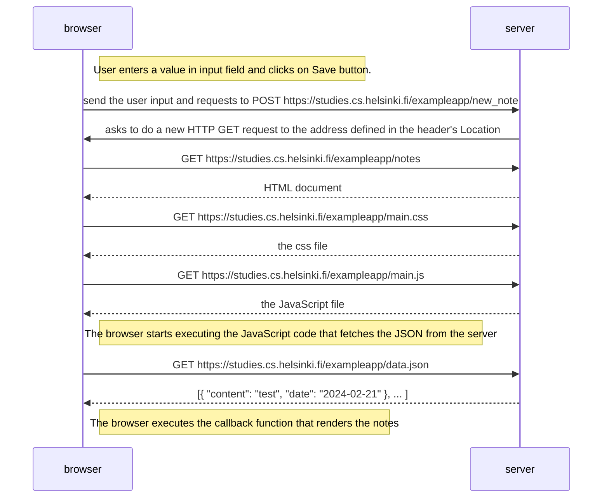

```mermaid
sequenceDiagram
    participant browser
    participant server

    Note right of browser: User enters a value in input field and clicks on Save button.

    browser->>server: send the user input and requests to POST https://studies.cs.helsinki.fi/exampleapp/new_note

    server->>browser: asks to do a new HTTP GET request to the address defined in the header's Location

    browser->>server: GET https://studies.cs.helsinki.fi/exampleapp/notes

    server-->>browser: HTML document

    browser->>server: GET https://studies.cs.helsinki.fi/exampleapp/main.css

    server-->>browser: the css file

    browser->>server: GET https://studies.cs.helsinki.fi/exampleapp/main.js

    server-->>browser: the JavaScript file

    Note right of browser: The browser starts executing the JavaScript code that fetches the JSON from the server

    browser->>server: GET https://studies.cs.helsinki.fi/exampleapp/data.json

    server-->>browser: [{ "content": "test", "date": "2024-02-21" }, ... ]

    Note right of browser: The browser executes the callback function that renders the notes

```
