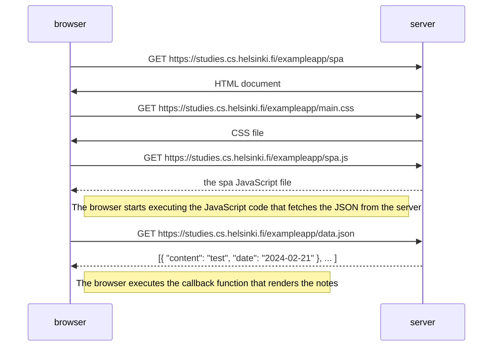

```mermaid
sequenceDiagram
    participant browser
    participant server

    browser->>server: GET https://studies.cs.helsinki.fi/exampleapp/spa

    server->>browser: HTML document

    browser->>server: GET https://studies.cs.helsinki.fi/exampleapp/main.css

    server->>browser: CSS file

    browser->>server: GET https://studies.cs.helsinki.fi/exampleapp/spa.js

    server-->>browser: the spa JavaScript file

    Note right of browser: The browser starts executing the JavaScript code that fetches the JSON from the server

    browser->>server: GET https://studies.cs.helsinki.fi/exampleapp/data.json

    server-->>browser: [{ "content": "test", "date": "2024-02-21" }, ... ]

    Note right of browser: The browser executes the callback function that renders the notes

```
